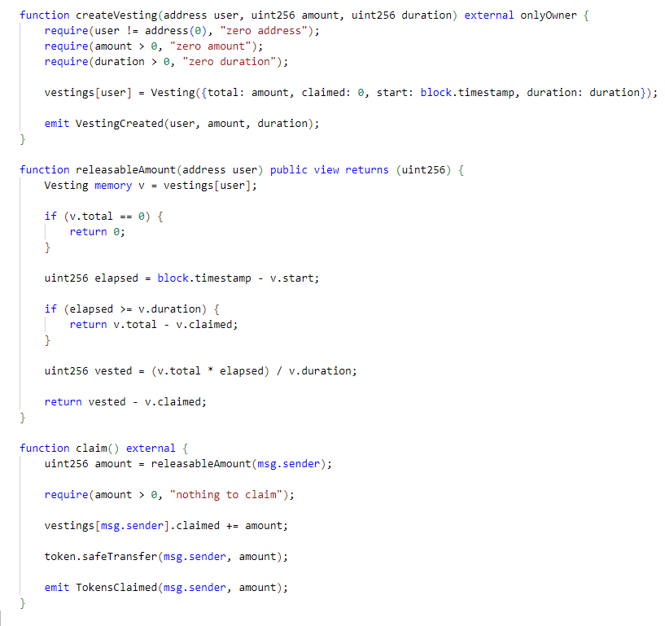
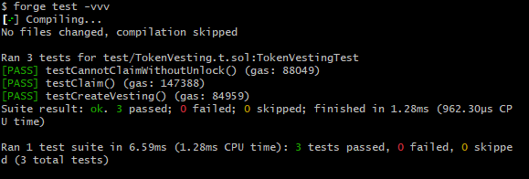

# Token Vesting Indexer

Minimal fullstack Web3 vesting system built with:

- Solidity
- Foundry
- Node.js
- PostgreSQL
- Redis

## Smart Contract

The Solidity smart contract is located inside:

```bash
contract/
```

Features:
- Linear token vesting
- Partial claiming
- Owner-controlled allocations
- Foundry test suite
- OpenZeppelin integration


## 📸 Project Overview

### Smart Contract Code


### Test Results

